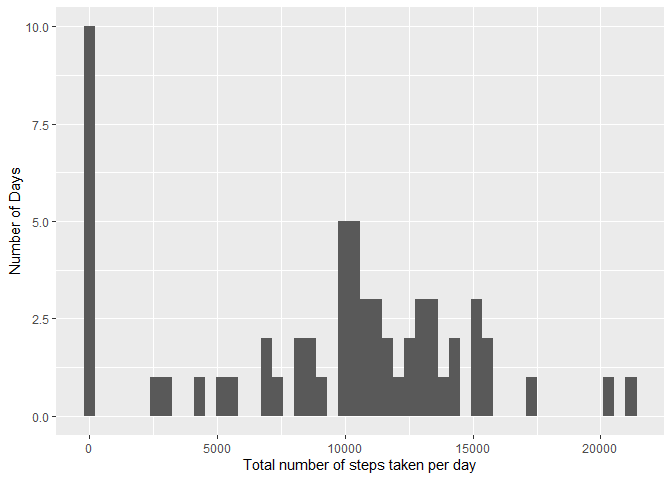
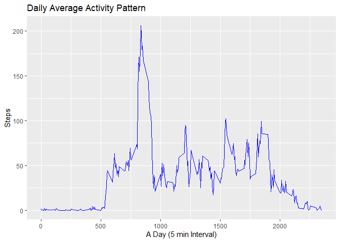
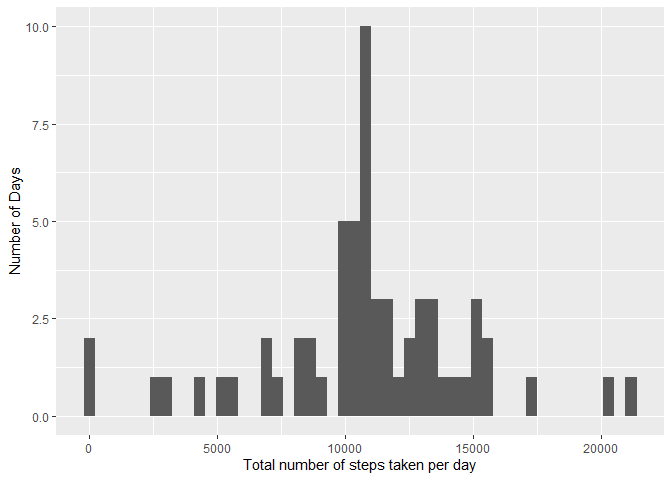
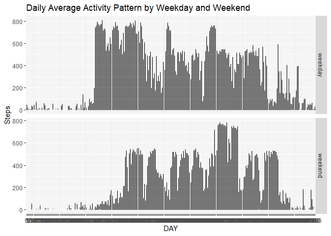

## Loading and preprocessing the data

```r
require(data.table)
```

```
## Loading required package: data.table
```

```r
require(ggplot2)
```

```
## Loading required package: ggplot2
```

```r
activity <- read.csv("./repdata_data_activity/activity.csv")
activity <- as.data.table(activity)
```

## What is mean total number of steps taken per day?
First calculate the total number of steps taken per day

```r
# Calculate the total number of steps taken per day
totalSteps <- activity[ , .(totalSteps = sum(steps, na.rm = TRUE)), by = .(date)]

#hist(meanSteps$avgSteps, xlab = "average steps", ylab = "No. of days")
ggplot(totalSteps, aes(totalSteps)) +
    geom_histogram(bins = 50) + 
    labs(x = "Total number of steps taken per day", y="Number of Days")
```

<!-- -->

Mean and Median steps taken per day


```r
print(paste("mean steps per day: ", 
            round(mean(totalSteps$totalSteps), digits = 0)))
```

```
## [1] "mean steps per day:  9354"
```

```r
print(paste("media steps per day: ", 
            median(totalSteps$totalSteps)))      
```

```
## [1] "media steps per day:  10395"
```

## What is the average daily activity pattern?
Make a time series plot (i.e. type = "l") of the 5-minute interval (x-axis) and the average number of steps taken, averaged across all days (y-axis)


```r
#png("plot1.png", width = 480, height = 480)
ggplot(na.omit(activity), aes(factor(interval),steps)) +
    geom_line() +
    labs(x="DAY", y="Steps") +
    labs(title="Daily Average Activity Pattern")
```

<!-- -->

```r
#dev.off()
```

## Imputing missing values
Calculate and report the total number of missing values in the dataset (i.e. the total number of rows with \color{red}{\verb|NA|}NAs)


```r
summary(is.na(activity))
```

```
##    steps            date          interval      
##  Mode :logical   Mode :logical   Mode :logical  
##  FALSE:15264     FALSE:17568     FALSE:17568    
##  TRUE :2304
```
Devise a strategy for filling in all of the missing values in the dataset. The strategy does not need to be sophisticated. For example, you could use the mean/median for that day, or the mean for that 5-minute interval, etc.


```r
imputeSteps <- function(DF, i) {
  sel <- DF$interval == DF$interval[i]
  imputed <- mean(DF$steps[sel], na.rm = TRUE)
  if (is.nan(imputed)) { # careful, there might be no other match
    imputed <- NA
  }
  return(imputed)
}

# apply the function to replace NA values with the mean of that interval

for (i in which(is.na(activity$steps))) {
  activity$steps[i] <- imputeSteps(activity, i)
}

summary(is.na(activity))
```

```
##    steps            date          interval      
##  Mode :logical   Mode :logical   Mode :logical  
##  FALSE:17568     FALSE:17568     FALSE:17568
```
Create a new dataset that is equal to the original dataset but with the missing data filled in.


```r
fwrite(x = activity, file = "activity1.csv", quote = FALSE)
```

Make a histogram of the total number of steps taken each day. 


```r
# Calculate the total number of steps taken per day
totalSteps <- activity[ , .(totalSteps = sum(steps, na.rm = TRUE)), by = .(date)]

#hist(meanSteps$avgSteps, xlab = "average steps", ylab = "No. of days")
ggplot(totalSteps, aes(totalSteps)) +
    geom_histogram(bins = 50) + 
    labs(x = "Total number of steps taken per day", y="Number of Days")
```

<!-- -->

Calculate and report the mean and median total number of steps taken per day. Do these values differ from the estimates from the first part of the assignment? What is the impact of imputing missing data on the estimates of the total daily number of steps?


```r
print(paste("mean steps per day: ", 
            round(mean(totalSteps$totalSteps), digits = 0)))
```

```
## [1] "mean steps per day:  10766"
```

```r
print(paste("media steps per day: ", 
            round(median(totalSteps$totalSteps), digits = 0)))      
```

```
## [1] "media steps per day:  10766"
```

## Are there differences in activity patterns between weekdays and weekends?


```r
activity$type <- ifelse(weekdays(as.Date(activity$date)) %in% c("Saturday", "Sunday"), "weekend", "weekday")
#activity$type <- as.factor(activity$type)

ggplot(activity, aes(factor(interval),steps)) +
    geom_line() +
    facet_grid(scales="free", space="free", type~.) +
    labs(x="DAY", y="Steps") +
    labs(title="Daily Average Activity Pattern by Weekday and Weekend")
```

<!-- -->
